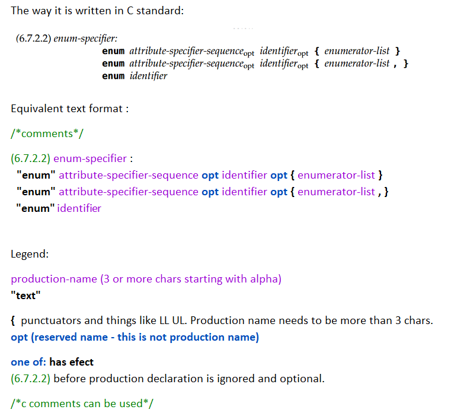

# C23 grammar for parser generators

This is a C23 grammar extracted from n3096 C 23 draff 
written in a text format matching almost 1:1 the pdf version.



grammar

Less than 3 chars means token. For instance [ is a token.
opt is reserved.
"literals" are tokens for instance "goto".
identifiers are productions.

```

```
